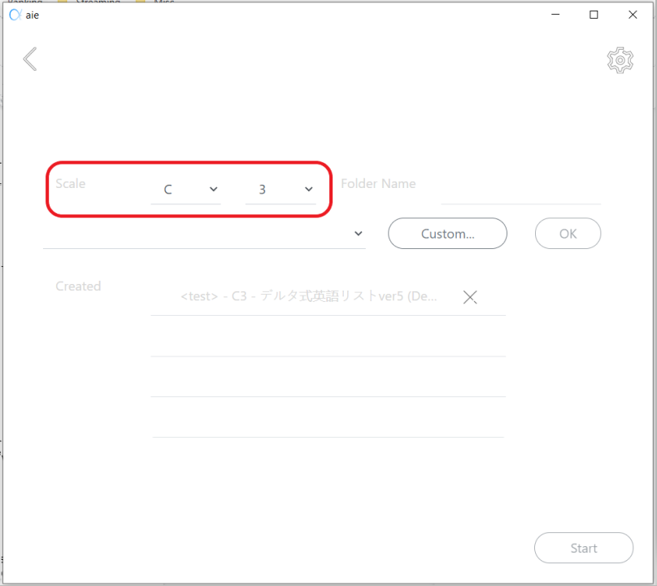
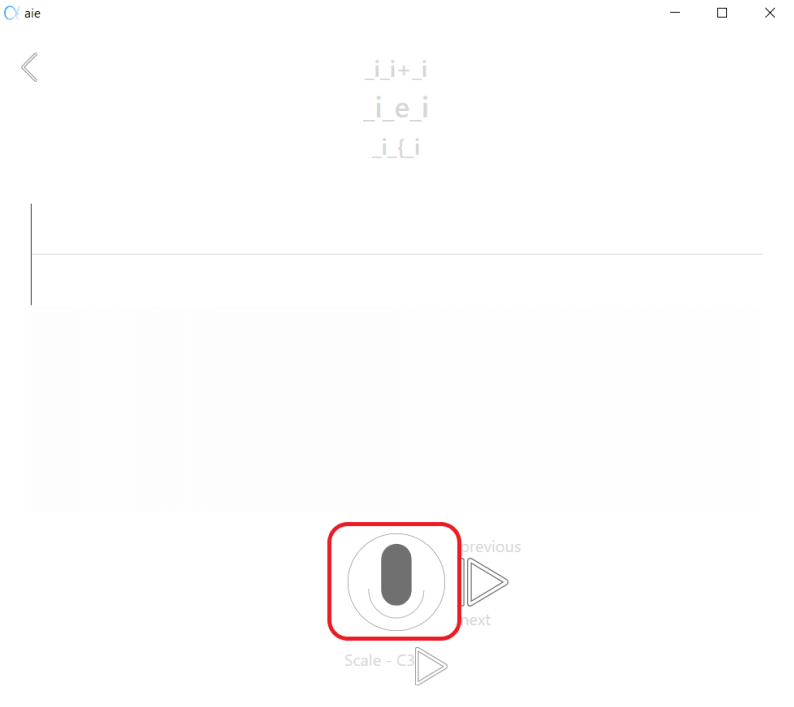

# Background

Vocaloid, a voice synthesizer, shook the music industry for over a decade.
Vocaloid leverages voicebanks, a collection of human voice samples and their
metadata, to generate human-like singing voices. Tools have been created to
enable average users to create their own voicebanks, but many of them lack
cross-OS and multi linguistic compatibility. To combat these shortcomings,
team-aie decided to create the next-generation tool, “aie”. Specifically, it is
going to address the issue of existing products with compatibility and usability
across a range of aspects by creating an Electron application and leveraging its
powerful capabilities out of the box. This document describes the existing
structure and design of aie and points out future work areas for the current
team.

# Version History

| Date       | Status      |
|------------|-------------|
| 2020-10-13 | First draft |
| 2021-02-16 | Update Audio Visualization Section |
| 2021-02-22 | Update Animations Section |
| 2021-02-23 | Update Project/Application State Saving and Loading |
| 2021-05-06 | Update feature documentation, add in architecture documents and various user documentation |

# UI design

The UI design is located at https://app.mockplus.cn/app/h7EZm9xha/design

Here are the screens coming from the design.

Note that in the dark mode, the fonts should be filled with colors (instead of
being transparent). The color is the same as the exterior lines.

### Welcome Page


### Create/select project


### Scale configuration


### Recording list preview (if “Show Detail” is clicked, will pull up from the bottom)


### Oto.ini preview (if “Switch To oto.ini” is clicked, will slide in from the right)


### Voice.dvcfg preview (if “Switch To voice.dvcfg” is clicked, will slide in from the right)


### Built-in recording list usage agreement (ToC) (If exists, if new project)


### Recording screen (correction: should display a gear button in the top right corner in this screen, not the scale configuration screen)


### Audio settings (if click on the gear button, or display when entering the project after the user agrees to the ToC)


# Detailed design

## Electron integration/Main process

The main process entry point is located at `src/main/index.ts` . It mostly
follows the official Electron boilerplate, which implements good default
behavior for cross-OS app launching and termination. The addition to the main
process launch code is best summarized as follows.

### Single-Instance Lock

The current implementation uses a pattern to ensure that when the user tries to
launch another instance of the application (such as launching it by
double-clicking the desktop icon):

1. No second instances are launched
1. If the first instance is minimized, this will also bring up that instance to

   the front

The first point is implemented with the following:

``` typescript
const isFirstInstance = app.requestSingleInstanceLock();

if (!isFirstInstance) {
  app.quit();
}
```

Whereas the second point is implemented with an event handler:

``` typescript
app.on('second-instance', () => {
  if (mainWindow) {
    if (mainWindow.isMinimized()) {
      mainWindow.restore();
    }
    mainWindow.focus();
  }
});
```

### Custom Menubar

For aesthetics and consistency with the design mock, the menu bar is hidden on
Windows and Linux by adding `Menu.setApplicationMenu(null);` . However, on
macOS, the menubar is not attached to the window but usually displayed farther
at the top of the screen. Therefore, it is not necessary to remove the menubar
altogether. Instead, the current implementation adds custom options to the menu
instead. This is achieved by creating a template object and calling
`Menu.buildFromTemplate(template)` to build the menubar and set it.

### Auto Updater

Electron Builder supports auto-updating [out of the
box](https://www.electron.build/auto-update). However, this application
currently doesn’t satisfy all of the requirements to enable that for macOS
users. Notably, in order to satisfy the requirements, the team needs to set up
code signing (notarization) of the macOS app. Because this process requires a
paid Apple Developer Account, this is not yet implemented. Instead, the current
implementation creates a wrapper of the Electron Builder auto-updater to
customize the behavior, including disabling it for macOS users, and displaying a
notification of the new version. When the user clicks on the notification, it
will open a link to let users download the new version themselves.

## Building and Releasing

The application uses Electron Webpack to build the app. However, there are
several customizations done to the Webpack configuration using customized
`webpack.something.config.js` files. Releasing is done using Semantic Release
with Github Actions. To allow for accurate calculation of next version numbers,
during development, the team must keep in mind the format of the commit message
that Semantic Release can understand. Semantic Release is also configured to
upload the packaged app to GitHub to release the next version of the app. Later,
auto-updater will query GitHub API to find this new version and apply updates.

### License Acknowledgement

The application provides a link to display the open-source licenses that the
project has depended upon. This is done using the
[WebpackLicensePlugin](https://github.com/codepunkt/webpack-license-plugin). To
support its usage, a nearly identical Webpack config is created with Webpack
hooks added to collect license information from WebpackLicensePlugin. Then, at
the end of the Webpack execution, it will write the information to
`src/renderer/licenses.ts` . This file is first overwritten with
`src/renderer/licenses.ts.base` , and the script will replace
`__LICENSE_CONTENT_HERE__` with serialized license information. Later on, this
file will be compiled with other TSX files to generate a table of open-source
licenses.

## Bundle Splitting of CSS Assets for Locales

A section is added to the renderer config to create separate CSS assets for each
of the locales. Later on, this will be read into the app via StyleSwitcher. More
details are in the Internationalization section.

## Internationalization

Internationalization is done on two levels: language/locale and font. When the
user updates their locale in the application, it not only loads the
corresponding translations but also loads the font package associated with that
locale. Among certain languages, one character might have the same Unicode
encoding, but they are written differently, which makes changing fonts
necessary. To make finding locale-specific translations and font configurations
easier, they are located at `src/locales/<locale ISO code>` . The translation
file is called “translations.json”, which contains a dictionary that maps from
translation key (usually the corresponding entry in English) to the translation
value (which is the translated expression). Because fonts are specified in CSS
via the `font-family` value, inside each locale folder, there is also an
“index.scss” file that specifies different fonts in each locale. During build,
each locale will generate its own CSS file, and can be loaded later with Webpack
loaders.

Detection, memorization, and implementation of locale switching are implemented
via `react-i18next` . It is a React-friendly `i18next` extension, meaning it
also depends on the `i18next` package as well. It has several detectors to
detect user locale when the app launches, and so far only navigator and local
storage ones are enabled. Navigator provides information regarding the user OS’s
locale settings, which should be a good default if the user launches the app for
the first time. Local storage is configured to store the user selection of the
locale whenever the selection is updated. Besides detection, `i18next` exposes
APIs to set the locale directly, which is used by LocaleSelector at
`src/renderer/components/locale-selector/index.tsx` .

To inform the rest of the application of the locale, a LocaleContext is created
at `src/renderer/contexts/locale-context.ts` and is provided at the root level
to the rest of the app. It is used by StyleSwitcher  at
`src/renderer/components/style-switcher/index.tsx` to swap for the
locale-specific CSS file.

## Accessibility

Currently, the application lacks provisions for accessibility in the custom
components. To satisfy the requirement that the entire application can be used
with only a keyboard, there is at least an action item of adding a `tabindex=0`

attribute to each of these components. However, as clearer requirements
regarding accessibility appear, there might be a need for further enhancement.
It is suggested that the team implement a library of custom components, such as
image-based buttons, that conform to the accessibility standards, and use these
components throughout the application.

## Project/Application State Saving and Loading

The app needs to ensure that its project can be copied-and-pasted to other
locations or computers and can still be read and used. This would most likely
result in a project file solution. However, this solution is currently missing.
The choice here will be relevant to the implementation of the project creation,
selection, and closure UI flow.

The app itself remembers the past projects and the last accessed timestamp
locally using an IndexedDB-backed [Dexie](https://dexie.org/) instance.

It is a requirement that the app remains a native feeling in that, for macOS
users, when they close the window and launch the new one, the application must
not forget where it was at - similar to the experience of minimizing and then
bringing to the front on Windows. Current solution is to record state variables
to local storage using `useLocalStorage` from `react-use` rather than `useState`

directly. However, discretion is needed when the state variable is concerned
with audio input devices, which may or may not stay the same when the app wakes
up.

### Design Plan

### Task 1: Add Settings button

Key tasks:

* Enable users to change setting in recording page

Related existing code:

  + `src/renderer/components/configure-recording-set-page/index.tsx`

Design detail:

* Add a setting button in the configure-recording-set-page, implemented by modifying page index in state
* The settings-page that is entered by clicking the setting button will be different from the default settings-page that is accessed by clicking the Start button on the configure-recording-set-page, as it will not contain the Confirm button that is used to reach the next page, the recording-page.
* The settings-page is entered by changing the page index, and return to the configure-recording-set-page by the Back button or the Ok button.

### Task 2: File Handling

Key tasks:

* Detect missing file while reading the file
* When file is missing, alert whether to retry
* Prevent user from deleting a file that is in use
* Detect moved file
* Detect existing project by detecting json file

Method used:

* [chokidar](https://chromium.googlesource.com/infra/third_party/npm_modules/+/e7396f39cd50de4419362fc2bc48360cb85ce555/node_modules/karma/node_modules/chokidar/README.md)

Related existing code:

* `src/renderer/components/configure-recording-set-page/configure-recording-set.tsx`
* `src/renderer/utils/FileMonitor.tsx`

Design detail:

* Chokidar, a better replacement of fs.watch and fs.watchFile, can be used to monitor the file status such as:
  + Delete file/folder - using listening for the 'unlink' / 'unlinkdir' event
  + Change file/folder - using listening for the 'change' / 'changedir' event
  + Add file/folder - using listening for the 'add' / 'adddir' event
* In `src/renderer/utils/FileMonitor.tsx` (located in utils folder), a list of functions are used to check the file status:
  + `watch(events: Event[])`
  + `ignoreFiles(eventsToIgnore: Event[], ignoredFilepath: Array<string>)`
  + `unwatch(events: Event[])`
* In order to ensure the intended operation from the app is not alerted
  + The file that the app is going to make changes to will be temporarily ignored in the watcher by adding that path to the ignored option under chokidar.watch function using ignoreFiles
* In order to watch the file status of the whole project
  + A new function called watch will be constructed and take the file path of the opening project as the parameter. It directly connected to all the project page for alerting any changes that happened
    - It will take an array of filePath that includes all the files related to the aie software and watches all the files
  + Key Issues
    - Using useState to sync the updated ignored option
* Reference:
  + https://chromium.googlesource.com/infra/third_party/npm_modules/+/e7396f39cd50de4419362fc2bc48360cb85ce555/node_modules/karma/node_modules/chokidar/README.md
  + https://github.com/paulmillr/chokidar

### Task 3: Project Status Resuming

Key tasks:

* Choose to resume previous progress while users open an in-progress project if the application detects an abnormal shutdown
* Localstorage should record the state of recording when it detects an abnormal shutdown
* The welcome page should pop out an alert and ask "We detected an abnormal shutdown. Do you want to continue from where you left off?" to users.
* The alert should have two options: "OK" and "Cancel". "OK" will direct the user to the recording page with the previous recorded item. "Cancel" will clear the state of recording in the localstorage and stay in the welcome page.

Method used:

* Localstorage
* `Unload` actionlistener for window

Related existing code:

* `src/renderer/components/welcome-page/index.tsx`
* `src/renderer/utils/localstorage-clear.tsx`
* `src/renderer/utils/localstorage-clear.test.tsx`

Information stored in the localstorage

* Constant `RETAINED_LOCALSTORAGE_KEYS` is created in `localstorage-clear.tsx`. It includes 8 variables that are used for storing state of recording.
  + `AieApp$keyOctave`
  + `AieApp$projectFolder`
  + `AieApp$recordingProject`
  + `AieApp$recordingSet`
  + `AieApp$recordingList`
  + `ConfigureRecordingSetPage$recordingSets`
  + `ConfigureRecordingSetPage$projectFile`
  + `RecordingPage$index`

Design detail:

* Clear localstorage in the `render/index.tsx` file
  + Call the custom hook `resetLocalStorage`.
  + `resetLocalStorage` stores the state of recording into constant `reservedStateValues`.
  + Localstorage is cleared after the state of recording is stored.
  + Retrieve stored values from `reservedStateValues` and put them back into localStorage after it is cleared.
* Detection in `utils/localstorage-clear.tsx`
  + Create a custom hook named `useResumeCheck`.
  + Window adds a listener to detect abnormal shutdown: `window.addEventListener('unload', function)`. This function will only trigger when the laptop is shutdown abnormally. In the function, it will clear the localStorage if it is triggered. Therefore, if the laptop is closed normally, this function will trigger and state of recording will be cleared.
  + Detect whether the state of recording is stored in localstorage by retrieving values of `RETAINED_LOCALSTORAGE_KEYS` and check whether it contains `null`.
  + Use a confirm method to pop out an alert and provide "OK" and "Cancel" options for users.
* Call the custom hook in `components/welcome-page/welcome-page.tsx`
  + `useResumeCheck` is called and passes `onResumeStatus` as the parameter used to direct page to recording page.

Testing:

* Use react-testing-library's `renderHook()` method to render the custom hook without rendering the component page.
* Use `jest.spyOn` to mock the mockImplementation of "confirm"
* Set "confirm" as `true` to test whether goToRecordingPage will be called if user clicks confirm.
* Set 'confirm' as `false` to test whether the localstorage will be cleared.

Reference:

* https://programmingwithmosh.com/react/localstorage-react/
* https://www.npmjs.com/package/react-confirm
* https://www.electronjs.org/docs/tutorial/quick-start
* https://reactjs.org/docs/hooks-custom.html
* https://react-hooks-testing-library.com/usage/basic-hooks
* https://jestjs.io/docs/jest-object

## Web Animation

### Non Functional Requirements

All animated page transitions shall occur smoothly, in a single motion, without any pauses or breaks.

1. All animated page transitions shall occur in under a second
1. All animated page transitions shall use the react-transitions-group library
1. All animated page transitions shall occur along the x and y axis: they should either move strictly left/right or up/down

Individual Transitions

1. On the recording set config page, selecting the “show details” button at the bottom of the screen should pull up the recording list preview page from the bottom.
1. On the recording list preview page, selecting the “hide details” bottom at the top of the screen will pull down the recording set config page
1. On the recording list preview page, selecting the right arrow will slide in the oto.ini preview page from the left
1. On the oto.ini preview page, selecting the right arrow will slide in the voice.dvfc preview page from the left
1. On the voice.dvfc preview page, selecting the right arrow will slide in the oto.ini preview page from the left

### Tests

Use these templates to complete manual testing on the animations.

#### Test 1

Preconditions:

* The application is on the ‘Configure Recording Set’ page
* The ‘delta english’ reclist is selected.

| Step       | Test Steps      | Expected Result  | Actual Result | Status |
|------------|-----------------|------------------|---------------|--------|
| 1 | Select ‘show details’. | The ‘Configure Recording Set’ page should slide up and offscreen, and the ‘List Preview’ Page should slide up from the bottom and onscreen. |   |   |

#### Test 2

Preconditions:

* The application is on the ‘List Preview’ page
* The ‘delta english’ reclist is selected.

| Step       | Test Steps      | Expected Result  | Actual Result | Status |
|------------|-----------------|------------------|---------------|--------|
| 1 | Select the arrow button on the right. | The ‘Preview Reclist’ page should slide to the right and offscreen, and the ‘oto-ini’ page should slide onscreen from the left. |   |   |

#### Test 3

Preconditions:

* The application is on the ‘List Preview’ page
* The ‘delta english’ reclist is selected.

| Step       | Test Steps      | Expected Result  | Actual Result | Status |
|------------|-----------------|------------------|---------------|--------|
| 1 | Select the up arrow button on the top | The ‘Preview Reclist’ page should slide down and offscreen and the ‘Configure Recording Set’ page should slide down and onscreen from the top. |   |   |

## Global Key Event Handler

### Initial Design

Initially, all the keybinds were stored in maps globally. This did not scale well and did not allow for good separation of responsibility between how different components handle different keystrokes.

### Current Design

Remove the global maps and instead use hooks to allow each component to declare and initialize its own key handlers. These handlers will be initialized when the component is mounted and removed when the component is unmounted. When the same keyhandler is used in multiple components, it can be extracted out to a separate file, and imported into the components it is used in so those components can initialize them.

An example of using hooks to navigate key presses can be found here: https://usehooks.com/useKeyPress/

In order to determine which keys are being pressed, the useKeyPress hook from react-use can be used to determine when single keys are being pressed.  For detecting multiple key presses, useKeyboardJS from react-use can be used.

React-use useKeyPress: https://github.com/streamich/react-use/blob/master/docs/useKeyPress.md
React-use useKeyboardJS:
https://github.com/streamich/react-use/blob/master/docs/useKeyboardJs.md

Files changed:

* Key-event-handler-registry was removed
* The only place any of the key-event-handler-registry methods were called was the hooks.ts file in for the recordingPage. The calls to addGlobalKeyDownHandler, addGlobalKeyUpHandler, etc were replaced with hooks that register the event handlers locally

### Testing

Use react-testing-library’s fireEvent() method to unit test keypress events - this method simulates firing events on the DOM.
Sample usage: fireEvent.keyDown(domNode, {key: ‘Enter’, code: ‘Enter’});
More details: https://testing-library.com/docs/dom-testing-library/api-events/

## Audio I/O and Manipulation

Media I/O is currently centralized in `src/renderer/services/media` . It knows
how to request for microphone permission, record microphone input, connect audio
graphs, and so on. It is too big to test easily, and also makes testing other
components more difficult. This needs to be broken down into smaller pieces.

## Audio Visualization

Audio visualization is currently centralized in `src/renderer/components/recording-page/recording-visualization.tsx` . The application will show the user two types of audio visualizations based on the current state. The two types of visualizations include a waveform and spectrogram. When the application is in the 'recording' state, a live waveform and spectrogram will update based on the microphone's input. The component will acquire the microphone device based on the chosen input device selected on the settings page. When the application is not in a 'recording' state, the waveform and spectrogram will update based on the .wav file for the current recitem. If no .wav file exists, no visualizations will show. The application also utilizes the FileMonitor so if the user ever deletes or adds a .wav file for the recitem, the visualizations will update appropriately.

The libraries used include the base [wavesurfer.js library](https://wavesurfer-js.org/), along with the [spectrogram](https://wavesurfer-js.org/plugins/spectrogram.html) and [microphone](https://wavesurfer-js.org/plugins/microphone.html) plugins.

 The details behind the current design are shown below.

### Design Plan for Rendering Live Visualizations

Method Used:

* waveform.js Microphone Plugin

Related Existing Code:

* Add in `types/` a `wavesurfer.microphone.d.ts` file
  + Ensures that the plugin imports correctly (similar to `types/wavesurfer.spectrogram.d.ts`)
  + Export a MicrophonePluginParams interface
  + Based on top comment on https://wavesurfer-js.org/doc/file/src/plugin/microphone.js.html
  + Export a MicrophonePlugin class with a static create function that takes in an input of type MicrophonePluginParams
    - Again, based on this source code https://wavesurfer-js.org/doc/file/src/plugin/microphone.js.html
* In `recording-page/recording-visualization.tsx`:
  + Add acquireAudioInputStream to the import statement from `../../utils`
  + `import { useAudioInputOutputDevices } from '../settings-page/hooks'; `
    - This is the subscription to the audio devices, the current input device id is used to acquire the used audio input stream on the microphone plugin
  + `const [, , audioInputDeviceId, , , ] = useAudioInputOutputDevices(); `
    - Get the audio input device id, we don’t care about the other variables that useAudioInputOutputDevices returns
  + `MicrophonePlugin.create({}), `
    - Add the microphone plugin to the existing wavesurfer instance’s plugin array
  + In the useEffect on [filePath, prevState, state]
    - Add `audioInputDeviceId` to the dependencies to run the useEffect on
    - Add `waveSurfer.microphone.pause();` in the not recording if before you read from the .wav file to make sure that the live visualizations are stopped and the instance is ready for the static visualizations
    - Add an else if for when the application is in a recording state
      - If the mic plugin is not active, call the `acquireAudioInputStream` to get the media stream object to pass into `wavesurfer.microphone.gotStream` which initializes the mic with the promised media stream
      - Else just call `waveSurfer.microphone.play();`

Design Detail:

* Use the waveform.js microphone plugin to do the live waveform.
* Most of the edit would be in `renderer\components\recording-page\recording-visualization.tsx`

### Design Plan for Rendering Static Visualizations

Method Used:

* waveform.js

Related Existing Code:

* In `recording-page/recording-visualization.tsx`:
  + Add a FileMonitor item and have it watch when files are added, unlinked, and changed to the project folder
  + Subscribe to that filemonitor item’s `getSubject()` function
    - Limit the events to ones that deal with just the current recitem’s wav file
    - On unlink empty the visualizations
    - On add reload the visualizations with the new file

Design Detail:

* If the recording item has a related .wav file
  + Show a waveform and spectrogram from the related .wav file
* If the recording item does not has a related .wav file
  + Show no spectrogram or waveform - would reuse the current code for this

### Design Plan for AutoZoom on Visualizations

Method Used:

* waveform.js

Related Existing Code:

Design Detail:

* Not going to do anything special, the automatic zooming on wavesurfer.js is sufficient to meet client needs

### Tests

Use these templates to complete manual testing on the audio visualizations.

#### Intergration Test 1

Preconditions:

* The application is on the recording page.

| Step       | Test Steps      | Expected Result  | Actual Result | Status |
|------------|-----------------|------------------|---------------|--------|
| 1 | Select ‘record’. | Live visualizations should load. |   |   |
| 2 | Say anything. | Waveform should show peaks when it picks up the user’s voice. |   |   |

#### Intergration Test 2

Preconditions:

* The application is on the recording page and in a recording state.

| Step       | Test Steps      | Expected Result  | Actual Result | Status |
|------------|-----------------|------------------|---------------|--------|
| 1 | Select ‘record’. | Live visualizations should stop. A popup will appear to say that the recording was written to a file.  |   |   |
| 2 | Select ‘okay’ on the popup. | The visualizations should update with the new .wav file. |   |   |

#### Acceptance Test

Description:
This will test the recording page’s audio visualization component to verify that it works as expected with the new live audio visualization feature. It should not show any waveform or spectrogram at first, then once ‘record’ is selected the live visualizations will start. They will show until ‘record’ is selected again, then the live visualization should stop and the static visualizations will be populated based on the .wav.

Preconditions:

* The application is on the recording page.
* The application is on a recording item that does not have an associated .wav file.

| Step       | Test Steps      | Expected Result  | Actual Result | Status |
|------------|-----------------|------------------|---------------|--------|
| 1 | Select ‘record’. | Live visualizations should load.  |   |   |
| 2 | Say anything. | Waveform should show peaks when it picks up the user’s voice. |   |   |
| 3 | Select ‘record’. | Live visualizations should stop. Static visualizations should show the entire recording based on the created .wav file. |   |   |

# Architecture

## Initial System Organization


### Category Descriptions

#### Components

The functionalities are shared between individual components and full pages. There are common subcomponents that are shared between pages. Pages are mapped out rendering for each page of the application. They consist of codes to render components and lightweight logic related to rendering.

__Contexts__

Contexts are static data sets that are shared by multiple pages across the application.

__Services__

The application has background services that exist across the entire application and stay alive the entire time when the application is running.

__Types__

Types is used to make typescript happy, allowing to import information from different file types.

__Utils__

Utils is stateless functionality not directly related to rendering, often shared across multiple components. It includes decoding buffers with implementation extracted because we are using different libraries and it also has rsjx-utils which are helper methods for rsjx, shared logic.

## Our Architecture


Our architecture was based on the Rich Client Application model as it was described in the Cervantes Textbook.  This model is described by the textbook as being the best for systems that are run and installed locally (which aie is) and are intended to provide a “high performance, interactive, rich user experience” which ties in well with one of our top quality attributes being usability.  This architecture suits both the technical needs of the system and some of our client’s top quality goals, making it perfect for us to use.

### Layer Descriptions

__Presentation Layer__

The presentation layer focuses on the parts of the program that are displayed to the user.  It has two main components: the User Interface, and the UI Process Layer.

_User Interface_

The user interface consists of components that are used to render the application.  The files for this are found inside the components folder of the project.

_UI Process Layer_

The UI (User Interface) Process Layer controls of the flow of the application.  It does this through storing and navigating the projects various states.  The UI Process Layer includes processes in the aie-app file and in the folders components and services/i18n

__Business Layer__

The business layer focuses on the actual logic of the system.  It is comprised of three main components: Business Workflow, Business Logic, and Business Entities.

_Business Workflow_

The business workflow manages the business processes of the application, and controls the Business Entities. This primarily includes the code in the file aie-app.

_Business Logic_

Business Logic retrieves and processes data by interacting with the Data Layer.  This includes all the files in the utils folder except for fs-utils.

_Business Entities_

Business Entities within the business domain, similar to objects in object oriented code.  These files can be found in the contexts and types folders.

__Data Layer__

The Data Layer serves as the connection between the Business Layer and the Local Data Sources.  It consists of the Data Access component, which allows for access of data by the Business Logic. It can be found in the files utils/fs-utils and services/media.

__Local Data Sources__

Since our project works with the local filesystem does not use a database, our data sources consist of the local file system and the computer’s I/O devices.

## Activity Diagram


This activity diagram describes the flow of our application through a series of actions that the user can take.

The system starts with the Welcome page. Here, the user has a few options to customize the application: switch the application theme or language. Once the user has made any desired application changes, the user can then choose to start the application or stay on the page to continue customizing.

Now that the application is started, the user can setup and configure the recording project. The first choice is either opening an existing project or creating a new project.

Once the user has the project opened, there are two paths they can take. The user can start configuring the recording set for the project or view the metadata of any of the built-in recording sets.

If the user chooses to go ahead and configure the recording set, they can either use an existing recording set in the project or create a new one. This step must be done for the user to move on to the next steps in the application. If the user chooses the metadata path, the user can look at the metadata until they decide they are done. The application then loops back into the previous choice.

Now that the recording project and set are configured, the user sets up the input/output devices they want to use for the recording step and agrees to the terms and conditions. This leads to the recording page.

The user can now record the recording item which creates a .wav file that they can play back or play the scale of. Once the user is done replaying the item and scale of the recorded item, the flow of activities is done.

## Quality Attribute Scenarios


Usability describes the ease with which a user is able to interact with a system and use it for its intended purpose.  Usability was one of the driving quality attributes behind aie because one of the problems aie is supposed to solve is the difficulty of using Oremo.  As a result, we focused on making sure that the flow from page to page in the application was clear and intuitive to a new user.


Modifiability is the ability to add new features to the aie project to fulfill any future demands of
the user. The overall architecture needs to be modifiable for future developers, especially because our client has more requested features for the project than we can feasibly implement within the scope of the project. The project follows a layered architecture approach which can be utilized later to easily add support for additional features.


Portability is the ability to easily adapt an application to run on more than the system it was designed to run on. One of the major goals of this project is the ability to take aie and have it run on most machines. When it was initially conceived, aie was designed for MacOS.  However, the application needs to run on multiple operating systems, and therefore it should be easy to add support for  Windows and Linux (the operating systems we currently are implementing support for) as well as for any future operating systems that the client may want to support.

## Technologies Used

### React

__Typescript__

Typescript is the programming language used for the majority of the system. It is Javascript with increased type functionality added. The application was using this already and the client wanted us to continue to use it.

__SCSS__

SCSS preprocessor is used to allow for CSS stylesheets to have more complex functions such as variables and inheritance. The application was using this already and the client wanted us to continue to use it.

__Bootstrap__

Bootstrap is a useful react framework that we utilize instead of building our own. The application was using this already and the client wanted us to continue to use it.

__RxJS__

RxJS is the library for reactive programming used to make asynchronous code easier to create. The application was using this already and the client wanted us to continue to use it.

__TS/TSX__

TS/TSX are file types for typescript files. The application was using this already and the client wanted us to continue to use it.

### Electron

Electron is the framework for creating an application. Since the client used it to create the application initially and wanted us to continue to use it, we maintained it as the framework for development.

__Webpack__

Webpack is the bundler of source code. The application was using this framework already and the client wanted us to continue to use it.

### External libraries

__WaveSurfer.js__

Wavesurfer is an audio visualizer that displays waveforms and spectrograms using either microphone input or a .wav file. We conducted research into multiple audio visualization libraries and decided that this one was the way to go because the client had already used the library for the base visualizations and it would be easy to expand the existing code to account for new features. We also have more control over the overall look of the produced waveforms and spectrograms than in other libraries.

__Chokidar__

Chokidar is the file system monitor that relies on the Node. js core fs module that can alert users with any changes within the monitored directories. It is an upgraded version to handle the mis-report issue from fs.watch, which is currently the best feasible implementation of the file system monitor we find.

## Detailed Design

### Introduction

In this document, we will discuss the strategies that we used to generate our system’s design after generating the architecture.  We will additionally provide examples of several of the design patterns that we used in order to demonstrate our process.

### Design Strategy

As we worked on only a small portion of an application, our design was restricted by the parts of the system that had already been written by the project’s prior developer. This meant that we had large parts of our architecture predetermined, and we had to design around these parts.
Our goal when designing new features was to add in the new features without disrupting the overall design of the application and only messing with large portions of the code when we were refactoring a component to be more reusable.

### Patterns utilized

__Transaction Script Pattern__


Transaction Script organizes business logic by procedures where each procedure handles a single request. This was a pattern that was primarily set up in the system when we began working on it and it works well with typescript’s functional elements. By following this pattern, we are able to ensure that each of our functional components does exactly one task which allows for separation of logic. This also allows us to split the work between team members more easily as each component does one thing and does not depend on much else.

__State Pattern__


Figure 1: aieApp and it’s concrete states


Figure 2: ConfigureRecordingSet index and its concrete states

State Pattern allows the application to alter behavior based on a state. In our case, each of these states indicates a page that should be displayed. All of our pages and components are React functional components. This makes our implementation flexible - changing the details of a page or a component does not require a rework of the entire application or of the surrounding pages. Depending on the state, the context class will determine which type of page should be rendered.  The interface encapsulates the details of what is rendered, how to render it, and what different actions on the page should do.  We use this state pattern in two ways:

* Our main app flow (figure 1)
* Substates off of the configure recording set page (figure 2)

__Composition over Inheritance__


Composition over Inheritance is the principle that code should be reused through composition in order to achieve polymorphic behavior. We’ve refactored some of the given code to create reusable components, and it has been an important part of our design going forward. One such example is shown above. We created a reusable image button that is composed of an onClick function, an image source, and a width that is used throughout many pages on the application. While these are always buttons, the behavior of the button changed based on the received variables. From that, we also created a back button that is composed of an ImageButton with a set source and width, but the provided onBack function changes for each instance it is used.

# User Guide

## Introduction

Our system, aie, is an application that allows users to record and save their own vocaloid voicebanks.  This document is intended to walk through how to use aie and describes its primary features.  Included are descriptions of how to set up a new recording project, how to configure a new recording set, how to record an item, how to change input/output devices (ie. speakers and microphones), and how to view the metadata of a reclist.  It also includes descriptions and images of each page in the application along with their associated purposes and uses.

### How-Tos

#### How to Setup a New Recording Project

1. Navigate to the 'Open Project' page.


1. Select the ‘Create’ button. This should open a file explorer dialogue.


1. Navigate to the folder you want the project to be saved in and type the desired name into the ‘Name’ textbox. Then select ‘Select Folder’.


#### How to Configure a New Recording Set

1. Navigate to the 'Configure Recording Set' page.


1. Select the Scale.



1. Enter the folder's name.


1. Select the recording list (either built-in or custom).

    Built-in: select an option in the dropdown menu


    Custom: select a location from the filesystem by selecting the “Custom” button


1. Click Ok to finish the configuration.


#### How to Record an Item

1. Open the project that you want to work on.


1. Select the recording set you want to work on from the ‘Created’ list. If the list you want to work on does not exist, follow the ‘How to Configure a New Recording Set’ to create it.


1. Select ‘Start’.


1. Select the next and/or previous buttons until the name of the item (circled in blue on the screenshot below) you want to record is shown at the top of the page.


1. When you are ready to start recording, select the recording button.



1. Click the recording button again when you have finished recording.


1. Select ‘Ok’ on the file written alert.


Now that you have recorded an item, it has created a .wav file in your project’s folder on your filesystem and it can be played back by selecting the play button on the ‘Recording’ page. The visualizations should have been updated to display the waveform and spectrogram of the entire recording.

#### How to Change Input/Output Devices

1. Navigate to the ‘Configure Recording Set’ page.


1. Select the ‘Settings’ button in the top-right corner.


1. Use drop-downs to select desired input and output devices.


1. Select ‘Ok’.


Note: If the desired device is not shown on the dropdown, your computer does not recognize it as an input or output device.

#### How to View Metadata of a Recording List

1. Navigate to the ‘Configure Recording Set’ page.


1. Select a recording list (either via the recording list dropdown or the “custom” button)


1. Select the down arrow button at the bottom of the screen.


1. The Reclist.txt file will be displayed. To iterate through the other metadata files, select the arrow button on the left side of the screen.


1. Navigate back to the Configure Recording Set page by selecting the up arrow button.


Potentially Available Metadata Files:
Reclist.txt: list of all of the recording items
oto.ini: configuration file that maps the vowels and consonants for recording items, used for UTAU software
voice.dvcfg: configuration file for use with DeepVocal software

Note: If one of the files listed above does not show up, the file does not exist in the recording set you selected.

### Page Descriptions

#### Welcome Page


Opening page for the application. Gives the user options to change from light/dark mode and to select a locale for the application.  Users start the application from here, which transitions to the Open Project Page.

#### Open Project Page


Allows the users to select a previously loaded project, open another existing project, or create a new project.

* Previously loaded projects will be displayed and can be clicked on to select them.
* Creating a project opens the file explorer so that the user can select a folder - once a folder has been selected the application navigates to the next page.
* Opening another existing project opens the file explorer so the user can select the project’s folder - once a folder has been selected the application navigates to the next page.
* The next page is the Configure Recording Set Page

#### Configure Recording Set Page


The project management page allows users to configure recording sets within the project. Users can adjust the setting of the recording set they are going to record before going to the Recording Page.

* Users can create their own recording list by following the operations below:
  + Users can set the scale when creating a recording set by selecting from the drop-down next to the scale text.
  + Users can set the folder name by entering the folder name on the input box next to the folder name text.
  + Users can select the built-in recording list by selecting from the drop-down menu below the scale options.
  + Users can select their custom recording list by selecting the custom button.
  + After the operations above are finished, users can click the OK button to create their own recording set.
* Users can set the input/output devices by selecting the setting button on the top-right corner of the page.
* Users can preview the metadata files by selecting the show detail button on the bottom of the page.
* Users can start recording by selecting the start button on the bottom-right corner of the page.

#### Metadata Pages


Metadata pages allow users to view various metadata files.  The current supported pages are voice.dvcfg files, oto.ini files, and Reclist files.

* The default page displayed is the Reclist file, since this should always be available.
* The other two pages can be toggled to when they are available (some projects may not have voice.dvcfg file or an oto.ini.

#### Settings Page


The project setting page allows users to configure setting options within the project.

* Users can select input device and output device.
* Users can select the Test Audio button to test the input and output setting.
* Users can select the Back button or OK button to turn back to Configure Recording Set Page.

#### Recording Page


The project recording page allows users to record voices for recording items.

* Users can select the microphone button to record voice for each recording item in the recording list. Users can select it again to stop recording.
* Users can select the Previous icon to switch to the previous recording item.
* Users can select the Next icon to switch to the next recording item.
* Users can select the Play button to play the recorded item.
* Users can select the Scale button to listen to the scale setting.
* Users can select the Back button to turn back to Configure Recording Set Page.

# Maintenance Plan

## Prioritized List of Features

Currently, there are no features that need to be implemented.

## Plan for Getting and Using Customer Feedback

Customers can submit issues on the GitHub repository in order to provide feedback to the developers. Developers will then take those raised issues and address any problems or suggestions when further developing.

## Plan for Supporting the Customer

Aie app will be downloadable via GitHub.  Customers will be able to download the latest code version from there and will be able to raise issues when they discover problems.  Developers will be able to address customer feedback by responding to the GitHub issues, and this will allow an organized way to connect bug fixes to specific releases.

## Plan for Dealing with Features Long Term

As new features are implemented and released, new releases will occur on Github.  Customers can suggest new features via Github issues.

## Developer Setup Guide

Recommended Development Environment: Windows Visual Studio Code

1. Clone the application to the developer's machine. The application can be found at: https://github.com/team-aie/app
2. Import the project folder to Visual Studio Code
3. Run 'npm i' in the terminal
4. To launch the application, select 'Run' -> 'Run Without Debugging'

## Troubleshooting Table

|Possible Error       | Solution      |
|------------|-------------|
| Live visualizations did not stop when you clicked the record button.  | Click the record button again, then hit your enter key. |
| The waveform is showing live feedback during recording, but there is no spectrogram. | The plugins are out of sync due to files being added/deleted during recording. Next time you hit record, it should be back in sync. |
| Live visualizations are showing movement during recording, but are not picking up your voice (i.e. no spikes in the waveform). | Check to make sure you have the correct audio input device selected on the settings page. Usually, it is trying to pull from the wrong microphone. |
